My hope is that one day this blog will be filled with overengineered solutions to problems that either don't exist, or are or of so little concern that they aren't worth the effort of solving.

One such non-problem is knowing when microwave popcorn are done popping. I had the idea when I had some friends over for a visit, and we wanted popcorn. I didn't want to leave the conversation, but I didn't want to leave the conversation. And while waiting for the popcorn to pop I started to wonder how one might automate the process of determining the doneness of microwave popcorn. My thought process was that since instructions on popcorn boxes often tell you to check the time between pops, if I could detect the individual pops, the challenge of determining doneness would be trivial. 

The code I wrote for this blog post, and the current state of the project, can be found at [This GitHub Repo](https://github.com/ahll19/popcorn_detection)

---

**Table of Contents**
---
- [1. Exploration](#1-exploration)
- [2. My Naive Algorithm](#2-my-naive-algorithm)
- [3 Does the algorithm detect popcorn?](#3-does-the-algorithm-detect-popcorn)
- [4 Does the algorithm work a second time?](#4-does-the-algorithm-work-a-second-time)
- [5 Conclusion](#5-conclusion)

---

# 1. Exploration
In order to test how I could detect individual pops, I needed to collect some data. This was done through a highly scientific process:

<center>Make microwave popcorn while recording it one my phone.</center>

After collecting data I loaded the resulting mp3 file into Python, in order to get a sense of what the data might look like.

My phone seems to have recorded at $32,000Hz$, which allows us plenty of resolution in frequency to analyze the popping of popcorn. In the figures below we see the waveform that the phone recorded, and the spectrogram of that waveform.

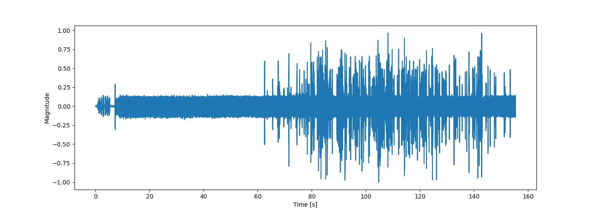

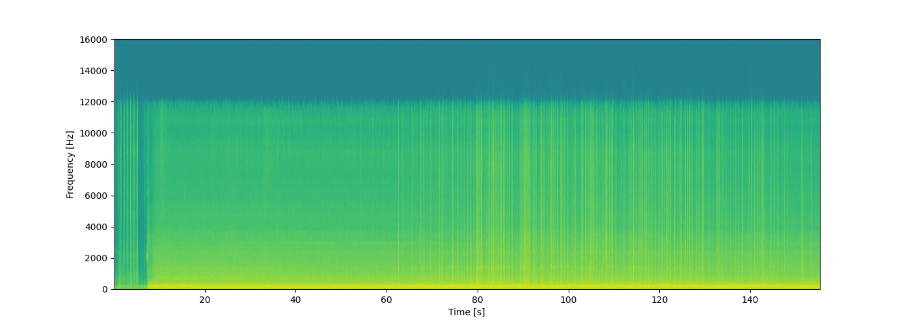

Looking at the waveform we see quite a lot of noise from the microwave, which seems to be on the low end of the frequency spectrum, when looking at the spectrogram. We also see a big loss in energy at the top of the frequency range of the spectrogram, which I honestly can't explain, other than my phone might not be able to pick up such high frequencies. From the spectrogram it looks as though the popcorn might be visible as vertical lines on the spectrogram, meaning the individual pops are quite broad spectrum. So in designing the algorithm which is going to detect pops we assume two things for now:
1. The pops are more or less uniform in the frequency range of $2000Hz$ to $10,000Hz$.
2. The energy of the noise produced by the microwave is mostly of frequencies lower than $4000Hz$. 

Using this let's create a band pass filter using `Scipy`, and set the critical frequencies to $f_{c1}=4000Hz$ and $f_{c2}=10,000Hz$. Filtering a signal according to a Butterworth band pass filter can easily be achieved by the following code.

```python
x, sr = audio2numpy.audio_from_file("popcorn.mp3")
x /= np.max(np.abs(x))  # Normalize the recorded waveform
t = np.arange(0, len(x)) / sr

a = signal.butter(5, [4000, 10000], btype="band", fs=sr, output="sos")
y = signal.sosfiltfilt(a, x)
```

After filtering we can see on the waveform in the figure below that most of the noise of the microwave has been removed.

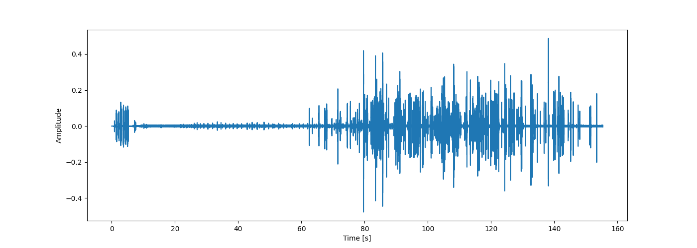

And now that we have removed much of the noise, we can zoom in on one single pop, and see what shape a pop takes in time (since we already "know" they are pulses which are uniform in frequency). Looking at the next figure we see that an impulse that decays exponentially. What is mostly of interest for this first implementation of a popcorn detector is the decay time, which from the plot below seems to be about 0.1 seconds. The exponentially decaying nature of the absolute waveform might be of interest in a more robust algorithm.

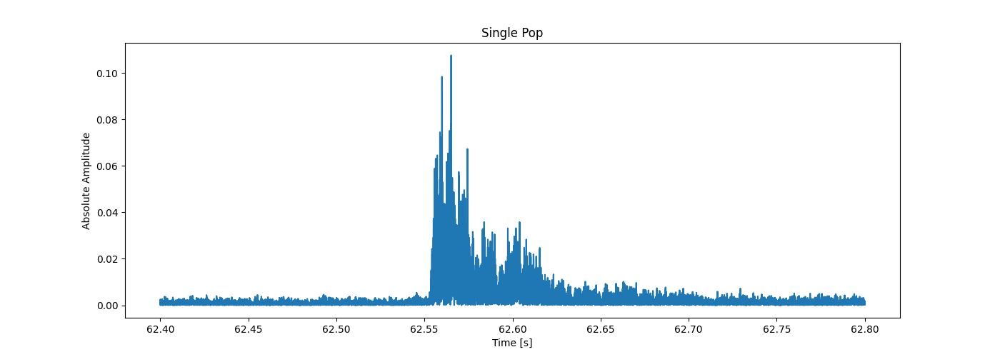

# 2. My Naive Algorithm
While using the shape of the shape of the waveform of a popcorn popping might be good for detecting individual pops, it seemed like a lot of work, so I chose to go with a more naive algorithm for now. 

I chose to use the uniformity of the spectrum of a popcorn pop, and came up with the following algorithm:
1. Calculate the STFT $X$ of the signal $x$.
2. Iterate through the time slices of $X$
   1. Check the mean value $\mu$ of the frequencies of $X$ which are between $f_{c1}$ and $f_{c2}$
   2. Calculate 
   $$
   \lambda=\sum_{f_{c1}< \omega < f_{c2}} |\mu - X_\omega(t) |^2
   $$
    for all the given time iteration $t$
   3. If $\lambda$ is larger than some threshold $\lambda_0$ then we call that a pop, and we skip the next iterations, corresponding to 0.1 seconds (this value is gained from the approximate time it takes a popcorn kernel to pop).
3. Calculate the time between each pop, and see if we are getting close to the value the manufacture specifies is the correct time between pops.

While this algorithm might seem ingenious and perfect, it does have some flaws that one might point out, even before testing it at all:
1. You have to know what value to set for $\lambda_0$.
2. The tool has no way of distinguishing between popcorn pops and perfect silence.
3. It might be slightly ineffective to carry out this many sums of squares calculations each second.
4. The algorithm doesn't allow for multiple pops to occur within a time-span of 0.1 seconds.

Do note that a plus of this algorithm is that we do not need to filter the signal, since we only consider the frequency range where we have assumed that no microwave noise is negligible. 

Hence, the title of this section. But no matter, let's see how this algorithm performs after tweaking the $\lambda_0$ parameter.

# 3 Does the algorithm detect popcorn?
By seeing what values $\lambda$ had for times when no popcorn were popping it seemed that $\lambda_0=4\cdot10^{-5}$ was a good value. This would remove most of the false positives induced by the noise in the signal, while still allowing relatively silent pops to be caught by the algorithm. I also cut the first 62 seconds of the signal for this test, since this is when the popcorn started popping.

Looking at the figure below, we see a wide angle view of when the individual pops where detected. By looking at the amount of red dots centered around the more busy parts of the signals, this seems to be a decent algorithm. 

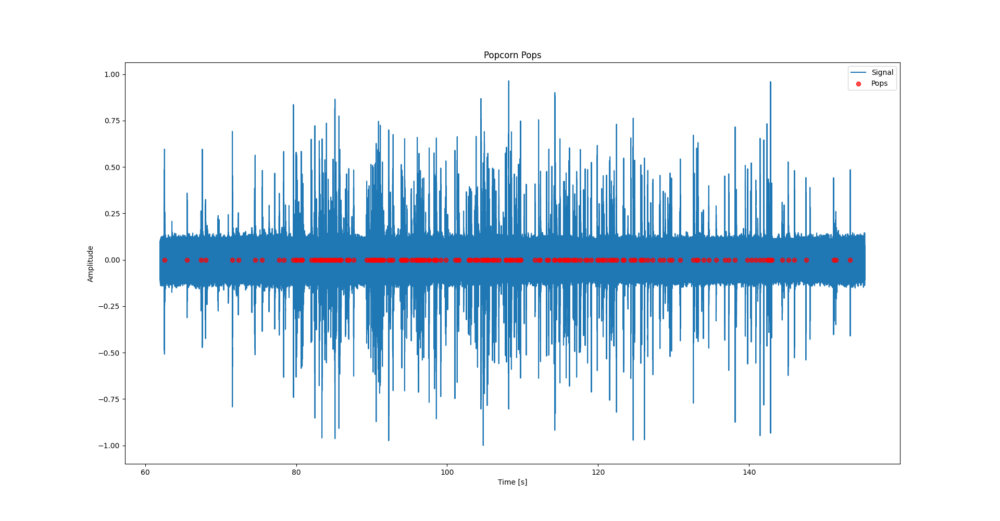

It is however not easy to make out individual pops this way, so I zoomed in on a part of the signal which highlights that this algorithm seems to work fine under the conditions of this test.

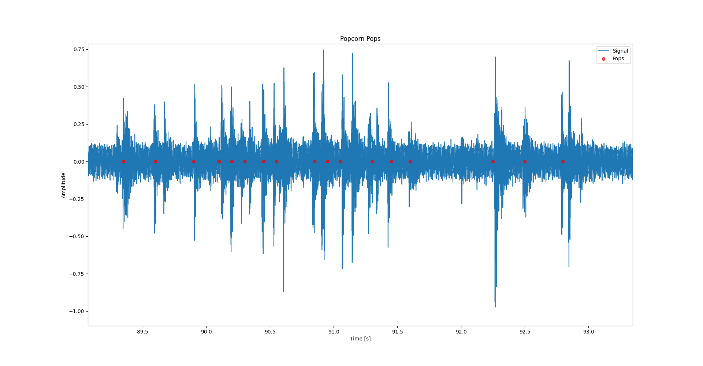

Looking at the figure above we see that the algorithm actually gets decent performance on this part of the signal. Scanning across the waveform it looks like the algorithm catches most of the pops which occur. And looking at the resulting time between pops, it does look promising.

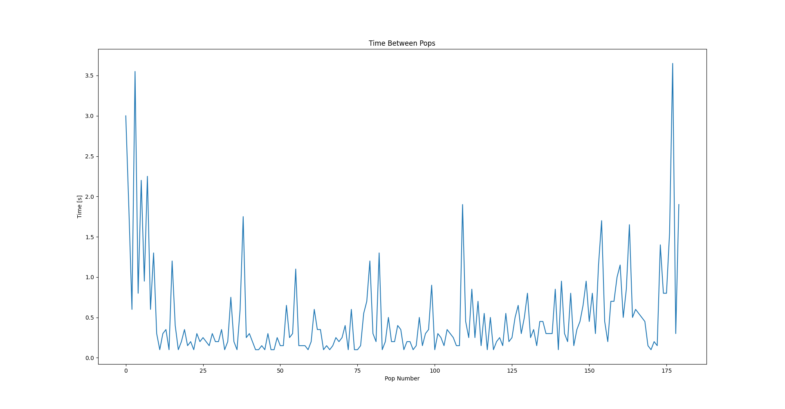
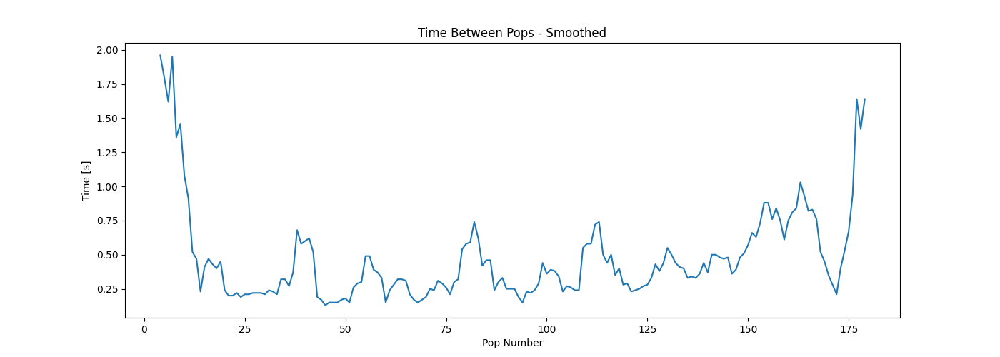

Seeing that taking a moving average with a window-size of 5 creates results that look like the one above, one might be tempted to slap this algorithm onto a microcomputer, wire it up to a microwave, and create a Kickstarter with a silly name. But this is a blog of science, so I did actually do more than one test on this algorithm.

# 4 Does the algorithm work a second time?
I used the exact same code as I did in the previous test, but changed the microwave and the brand of popcorn. Ideally I would've also used a different method of recording, but that might be covered in an improved popcorn detection algorithm.

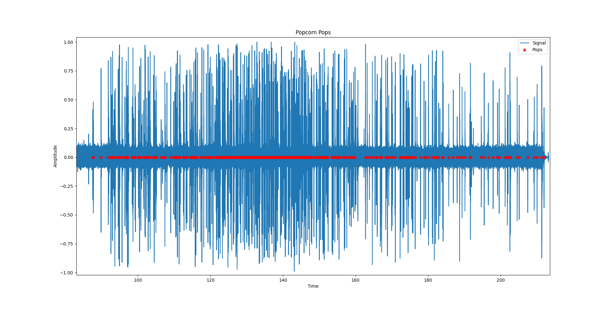

Above is a wide view of the detections in the second test. I was happy and surprised to see that the algorithm seemed to have worked. I had expected the algorithm to either detect basically no popcorn, or to have a lot of false positives. Zooming in we see that there seem to be no false positives, but some pops are not detected.

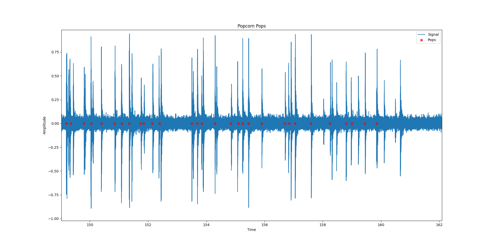

One would expect the algorithm to call the popcorn done before they were actually done, given that some pops were not detected. But even though that the time between pops is calculated to be higher than what it actually is, we still ended up getting popcorn that had been in the microwave for too long.

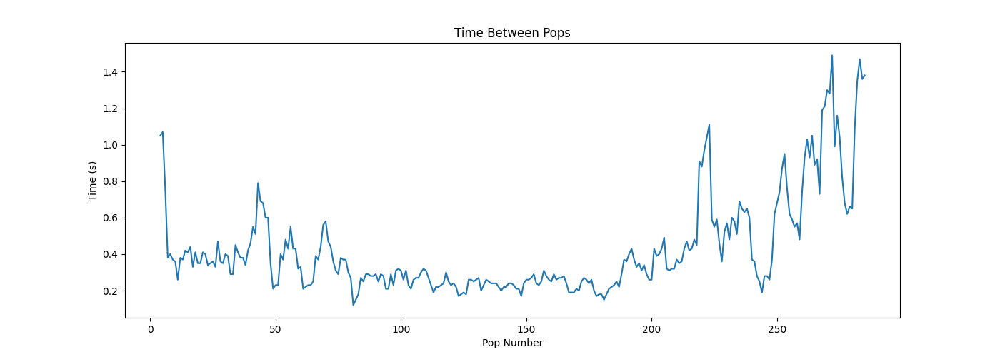

Above we see the smoothed time between pops, and it never even reached 2 seconds. Even when not smoothing the time between pops, the time never got higher than 1.6 seconds. This means that if we had only used the algorithm to evaluate the doneness of the popcorn, We would've burned the popcorn.

# 5 Conclusion
Much to my surprise, the algorithm seemed to have worked, to some extent. The detection of individual pops works quite well, even though it does miss some pops. If we were to use this detection method, along with the instructions on popcorn packages that say to wait until pops are 2 to 3 seconds apart, we would burn our popcorn. So I need a new way of evaluating when the popcorn are done, if I wanted to keep using this method of detection.

I might continue on this project, and change/improve some things. Among these are
1. I want to use a new way of detecting, namely matched filtering which seems interesting to learn about.
2. I want to use the [PyAudio](https://people.csail.mit.edu/hubert/pyaudio/docs/) library to stream the audio to a Python script, so I can evaluate the performance of my algorithm by actually using it to create popcorn.