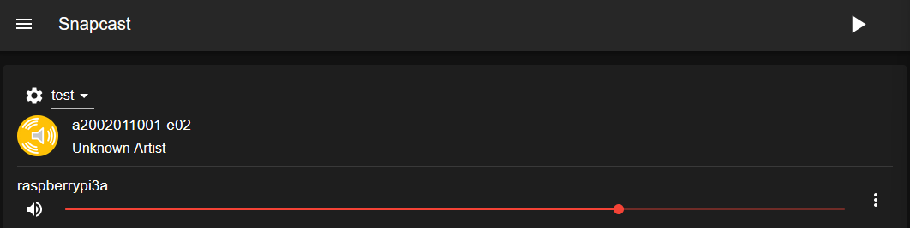

# General Notes
Notes which aren't easy to fit into any category...

## Reducing Scope
Scope creap is a real thing, and it happened to this project as well. After working on and thinking about this project for quite some time, I found myself wanting to create a very involved sonos-like setup. I thought it would be cool to integrate this with Home Assistant, which it would, but I ended up deciding that this would be a project by itself. <br>
My mission for this project is to have one device show up as a Spotify Connect device on the network (not just for me, but anyone on the network), and then have it cast sound to one or more speakers. 

## Skipped Details
Some details on the software side of things are skipped. This is where I am just following Andreas Skoglund's guide closely. I do not want to just re-post what he has already written up, and I reccomend supporting him on [Ko-Fi](https://ko-fi.com/whynotguide) if you find this guide useful.

# Speaker Notes

**Todo**
1. Make schematic of speaker internals
   1. [Cement resistors](https://www.bennic.com.tw/catalogue/en/Resistors-en.pdf) (white boxy things) 
   2. [film capacitor](https://frequence.dk/hifi/424-bennic-capacitors/6728-bennic-mt-10-microf-100v-5/) (not this exact one but something close)
   3. Perhaps the copper coils are inductors? Check out my reddit post I guess.
2. Add link to speaker brochure, probably through internet archive or something

## Wiring
Extremely difficult to find information on caps and coils

# Software Notes
[Snapcast inspiration and guide](https://whynot.guide/posts/howtos/multiroom-media/)
- Pi5 running snapcast server 
- pi3a+ running snapcast client

## Snapcast
On the [GitHub page](https://github.com/badaix/snapcast) of Snapcast they say that

>Snapcast is a multiroom client-server audio player, where all clients are time synchronized with the server to play perfectly synced audio. It's not a standalone player, but an extension that turns your existing audio player into a Sonos-like multiroom solution.

This is more or less exactly what I want in an audio setup. However, setting this up is not trivial. Thankfully, Norwegian software architect Andreas Skoglund wrote a great [blog post](https://whynot.guide/posts/howtos/multiroom-media/) which I am following in order to create my setup.

### First Setup
Since Snapcast is distributed to Debian based systems, I could just download and install the packages from the [release page](https://github.com/badaix/snapcast/releases).

After installing the correct packages I went and tested the setup. I have my Pi 5 and Pi 3A+ hooked up to the same network, and my headphones plugged into the AUX port of the Pi 3A+ . After opening up a terminal on the Pi 3A+ I opened `alsamixer` to turn the volume, in order to not blow out the speakers of my headphones. I then ran the `snapclient` command to spawn the client, and logged into my Pi 5. On the Pi 5 I have tmux installed, and opened up a session. In the first window I started the server by running `snapserver`. I opened up a new window, and then ran `cat /dev/urandom > /tmp/snapfifo`. This should start playing white noise on the headphones plugged into the headphones.

The files `/dev/random` and `/dev/urandom` provide an interface to the random number generator in the Linux kernel, the difference between them being that the form the former will block reading if the system is not able to generate "random enough" numbers, and the latter will never be blocked. This is lifted from [this post](https://linuxhandbook.com/dev-random-urandom/) from the Linux Handbook.

When I first did this I ran into permission issues, since Snapcast creates a user and group for that user called `snapserver`, on the server. I had to change the ownership of the file using `chown` in order to test this in my case, but switched the owner back after testing.

### Daemonizing Snapserver
When I was first messing around with Snapcast I accidentally set some configuration options in one of the configuration files for `snapserver`. This led to me wasting a good hour before figuring out why I could not start the server as a service. <br>
With `/etc/default/snapserver` file on my Pi 5 which looks like this

```yaml
# Start the server, used only by the init.d script
START_SNAPSERVER=true

# Additional command line options that will be passed to snapserver
# note that user/group should be configured in the init.d script or the systemd unit file
# For a list of available options, invoke "snapserver --help"
SNAPSERVER_OPTS=""
```
I was able to enable and start the server using `systemctl` as you would any other daemon.

To test this I downloaded a `.wav` file using wget, and added the following option under the `[stream]` tag in `/etc/snapserver.conf` on the Pi 5.

```yaml
...
[stream]
stream = file:///opt/a2002011001-e02.wav?name=test
...
```
This allows me to go the the local ip of the Pi 5 on port 1780 in a browser, and see a web interface for Snapcast, with the clients listed on that site:


**Note:** *I never actually enabled the client service on the Pi 3A+, but it seems that it is enabled, and works as it should. I did not have to set it up any further than that. I also do not remember how I pointed the client to the server's IP, but if it works it works.*

## Librespot
I have written about [Raspotify](https://github.com/dtcooper/raspotify) before in my post [Smarthome Saga Part 1](https://anders-lauridsen.dk/smarthome_saga_part_1), and it does seem like the easiest way to get what I wanted up and running. I am however, still mostly following the blog post from Andreas Skoglund, and as such I will be installing [Librespot](https://github.com/librespot-org/librespot) as he recommends in his post.

I did have to do one thing which was not mentioned in Andreas' blog post. I had to install some extra dependencies (`libasound2-dev, portaudio19-dev, build-essential, libpulse-dev, libdbus-1-dev`) on my Pi 5. This was pointed out in [this](https://github.com/Spotifyd/spotifyd/issues/659#issuecomment-674641548) comment on GitHub.

After configuring the stream as he did, with my own username and password of course, it worked perfectly. I went in and commented out the only other stream (`/tmp/snapfifo`), and now the Pi 5 is listed on the network as a Spotify Connect device, which automatically casts the sound from spotify to all other devices.

## Snapcast, again?
android?