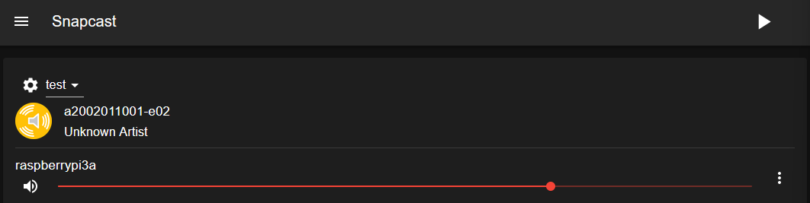
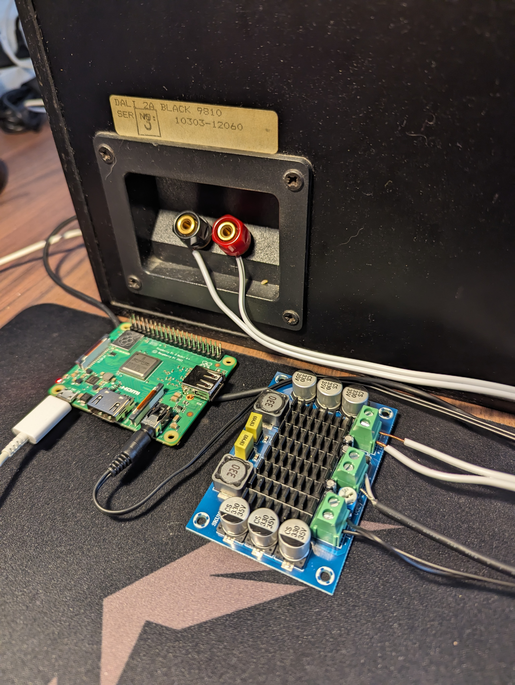

The goal of this project is to make an old speaker function as a smart speaker. I want to select a speaker on Spotify, and then have some of my old speakers from the 80's play that music. I already did something like this in my [Smarthome Saga Part 1](https://anders-lauridsen.dk/smarthome_saga_part_1) blog post. The issue with that setup is that every set of speakers need to be listed as a single speaker on Spotify, which prohibits multiroom audio. <br>
So the goal is to be able to play music from Spotify on some old speakers as if they were modern smart speakers, in a way that scales easily to more than that speaker. It should also be able to integrate this into Home Assistant, so that I only need to interface with my smarthome in one place.

Some details on the software side of things are skipped. This is where I am just following [this guide](https://whynot.guide/posts/howtos/multiroom-media/) from Andreas Skoglund closely. I do not want to just re-post what he has already written up, and I recommend supporting him on [Ko-Fi](https://ko-fi.com/whynotguide) if you find this guide useful.

Also big thanks to [Nikolaj Krægpøth](https://www.linkedin.com/in/nikolaj-kr%C3%A6gp%C3%B8th/) for helping out with this project. He saved a lot of time, and probably some headaches, in the electronics part of this project.

**Table of Contents**

---

- [Software](#software)
  - [Snapcast](#snapcast)
    - [First Setup](#first-setup)
    - [Daemonizing the Snapserver](#daemonizing-the-snapserver)
  - [Librespot](#librespot)
- [The Speakers](#the-speakers)
  - [Internals of the Speakers](#internals-of-the-speakers)
  - [Amplifiers and Sound](#amplifiers-and-sound)
- [Conclusion](#conclusion)
  - [Issues and Further Work](#issues-and-further-work)

---

# Software
My choice of software is very much dictated by the blog post from Andreas Skoglund, since I want to get a proof of concept up and running as soon as possible. I will for sure add more software to the stack in a future iteration of this project.

## Snapcast
On the [GitHub page](https://github.com/badaix/snapcast) of Snapcast they say that

>Snapcast is a multiroom client-server audio player, where all clients are time synchronized with the server to play perfectly synced audio. It's not a standalone player, but an extension that turns your existing audio player into a Sonos-like multiroom solution.

This is more or less exactly what I want in an audio setup. This section walks through how I set up my current configuration of Snapcast.

### First Setup
Since Snapcast is distributed to Debian based systems, I could just download and install the packages from the [release page](https://github.com/badaix/snapcast/releases).

After installing the correct packages I went and tested the setup. I have my Pi 5 and Pi 3A+ hooked up to the same network, and my headphones plugged into the AUX port of the Pi 3A+. After opening up a terminal on the Pi 3A+ I opened `alsamixer` to turn the volume, in order to not blow out the speakers of my headphones. I then ran the `snapclient` command to spawn the client, and logged into my Pi 5. On the Pi 5 I have tmux installed, and opened up a session. In the first window I started the server by running `snapserver`. I opened up a new window, and then ran `cat /dev/urandom > /tmp/snapfifo`. This should start playing white noise on the headphones plugged into the headphones.

The files `/dev/random` and `/dev/urandom` provide an interface to the random number generator in the Linux kernel, the difference between them being that the form the former will block reading if the system is not able to generate "random enough" numbers, and the latter will never be blocked. This is lifted from [this post](https://linuxhandbook.com/dev-random-urandom/) from the Linux Handbook.

When I first did this I ran into permission issues, since Snapcast creates a user and group for that user called `snapserver`, on the server. I had to change the ownership of the file using `chown` in order to test this in my case, but switched the owner back after testing.

### Daemonizing the Snapserver
When I was first messing around with Snapcast I accidentally set some configuration options in one of the configuration files for `snapserver`. This led to me wasting at least an hour before figuring out why I could not start the server as a service. <br>
With `/etc/default/snapserver` file on my Pi 5 which looks like this

```yaml
# Start the server, used only by the init.d script
START_SNAPSERVER=true

# Additional command line options that will be passed to snapserver
# note that user/group should be configured in the init.d script or the systemd unit file
# For a list of available options, invoke "snapserver --help"
SNAPSERVER_OPTS=""
```
I was able to enable and start the server using `systemctl` as you would any other daemon.

To test this I downloaded a `.wav` file using wget, and added the following option under the `[stream]` tag in `/etc/snapserver.conf` on the Pi 5.

```yaml
...
[stream]
stream = file:///opt/a2002011001-e02.wav?name=test
...
```
This allows me to go the the local ip of the Pi 5 on port 1780 in a browser, and see a web interface for Snapcast, with the clients listed on that site:


**Note:** *I never actually enabled the client service on the Pi 3A+, but it seems that it is enabled, and works as it should. I did not have to set it up any further than that. I also do not remember how I pointed the client to the server's IP, but if it works it works.*

## Librespot
I have written about [Raspotify](https://github.com/dtcooper/raspotify) before in my post [Smarthome Saga Part 1](https://anders-lauridsen.dk/smarthome_saga_part_1), and it does seem like the easiest way to get what I wanted up and running. I am however, still mostly following the blog post from Andreas Skoglund, and as such I will be installing [Librespot](https://github.com/librespot-org/librespot) as he recommends in his post. <br>
The biggest difference in practice is that I had to compile the Rust code myself, instead of running the install script from Raspotify.

I did have to do one thing which was not mentioned in Andreas' blog post. I had to install some extra dependencies (`libasound2-dev, portaudio19-dev, build-essential, libpulse-dev, libdbus-1-dev`) on my Pi 5. This was pointed out in [this](https://github.com/Spotifyd/spotifyd/issues/659#issuecomment-674641548) comment on GitHub.

After configuring the stream as he did, with my own username and password of course, it worked perfectly. I went in and commented out the only other stream (`/tmp/snapfifo`), and now the Pi 5 is listed on the network as a Spotify Connect device, which automatically casts the sound from spotify to all other devices.

# The Speakers
The picture in the intro is the internals of one of my 2 VERY old Dali speakers. They seemed to be a good fit for this project because they were VERY cheap on Facebook Marketplace.

## Internals of the Speakers
I took them apart to get an idea of how they were wired up. There are 2 cement resistors (white boxy things), which are also the only 2 components where the specs are known. The big yellow capacitor has *some* capacitance, and the inductors also have *some* inductance.  I had hoped to get the exact values and derive the filter specifications on what is passed to the woofer and tweeter. This idea was scrapped when I couldn't find these values.

## Amplifiers and Sound
I bought a "TPA3116D2" amplifier of off AliExpress which in theory is way overspecced for this build. They take around 18V input, with a wide range of acceptable input voltages. It also takes the sound signal over 2 terminals. And of course it has an amplified output of some sort as well.

In order to power the amplifier I cut and stripped the wire of an old laptop charger which runs at 19V and 1.75A, which should be plenty to power the speakers.

In order to get sound to the amplifier I cut and stripped the wires of an old pair of crappy headphones, which connects to the Pi 3A+ over an AUX jack.

To get the sound to the speaker I used some old speaker cables I had lying around in the apartment.



The picture above shows the wiring of this system (the middle terminals are the power-in from the laptop charger). Between the audio-in and power-in terminals there is a potentiometer used to set the volume of the speakers. In a future iteration of this project I will find a maximum acceptable volume for the speakers, and "lock it in", to remove the possibility of blowing out the speakers.

# Conclusion
PoC could be short for proof of concept, or it could be short for piece of crap. Both of these acronyms are good descriptors for how this project turned out.

This PoC technically worked! I was able to find the Snapcast server on the Spotify Discover list. Playing music then casts the music from the Pi 5 to the Pi 3A+. This sound is then amplified using the AliExpress amplifier and sent to the speakers. I have to admit that I did a little dance and started dancing when the speaker played the song.

The sound quality of this PoC is not very good, and the wiring is horrendous.

## Issues and Further Work
One big issue is that the signal quality is not all that great, and nothing is grounded. This results in a hissing and popping sound constantly playing on the speaker. As of now there is also no Home Assistant Integration.

I am not going to keep the system running, since I would lose my mind of that noise was constantly playing in my apartment. It is also not the nicest thing to look at in it's current state. I am also not allowed to keep the Pi 3A+, unfortunately.

Next iteration of this project would be to install the Snapclient software on a few old Android phones, and ground the connection to remove the hissing noise. I would also like to move as much of the electronics into the body of the speakers as possible. If it is within scope I would also like to integrate the Snapcast system into Home Assistant.

All in all this project has been a success, since I accomplished the goals I set out, even though the PoC can best be described as "janky".