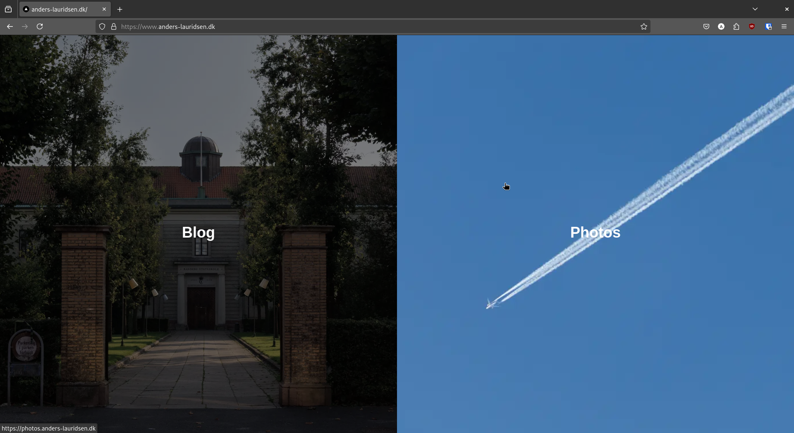

When I was a teenager I was often in charge of using the family camera to photograph the birthdays and other gettogethers we were a part of. Over the years I got more and more interested in photography in general, and it's become a hobby that I love.

Last summer I bought an expensive camera, since the one I got from my grandfather was starting to show it's age (a Canon EOS 400D DSLR). So I bought a Canon EOS RP instead.

Fast forward half a year and I'm getting the hang of this thing, and I want to show off my photographs, more than just post them on instagram. I already have a domain, and Adobe Portfolio is included in my Creative Cloud subscription, so I thought I might as well just have them host my "portfolio". Now I just need a landing page to host the links to my blog AND my "portfolio".


**Table of Contents**

---
- [My Landing Page and Overall Setup](#my-landing-page-and-overall-setup)
  - [I Have No Idea How to Write Javascript](#i-have-no-idea-how-to-write-javascript)
  - [My Overall Setup for my Personal Sites](#my-overall-setup-for-my-personal-sites)
- [Why I'm not Scared that LLMs Will Take our Jobs Anytime Soon](#why-im-not-scared-that-llms-will-take-our-jobs-anytime-soon)

---


# My Landing Page and Overall Setup



The image above is a screenshot of my landing page at thte time of writing. It consists of a split view, with one image in each view, and the overlaid text. When the mouse is not hovered over one of the images the saturation and brightness of that image is reduced, and the images are animated to remove those effects, and zoom in, when hovered over. The split is dependent on what axis of the window is widest, meaning that the page would split horizontally on phone screens. The "Blog" image forwards to [blog.anders-lauridsen.dk](https://blog.anders-lauridsen.dk/) and the "Photos" forwards to [photos.anders-lauridsen.dk](https://photos.anders-lauridsen.dk/).

The landing page is written in Javascript, and I would like to state for the record that I have never written any Javascript before this, and I'm not entirely certain about the specifics I am using for this landing page.

## I Have No Idea How to Write Javascript

So why would I write it in Javscript?!

Before creating a landing page I wanted to check out my options for hosting such a page, since I didn't want to selfhost it. After some digging around I decided that I wanted to use Vercel, since they have an attractive free tier for hosting websites. It just so happes that Vercel are also the creators of Next.JS, so it seemed fitting to create the landing page using their own framework.

I set up a [GitHub repo](https://github.com/ahll19/landing-page), opened up ChatGPT, and went to town creating my new landing page. I actually ended up struggling quite a bit, which I will touch on later in this post.

## My Overall Setup for my Personal Sites

Right now I have three websites under the domain [anders-lauridsen.dk](https://www.anders-lauridsen.dk/). I have my landing page, my blog, and my "portfolio". My blog is still hosted on GitHub Pages as I described in [this](https://blog.anders-lauridsen.dk/creating-my-website) post. My "portfolio" is hosted on Adobes servers, and created using their Adobe Portfolio tool. And my landing page is, as mentioned before, hosted on Vercel.

It was a bit of a hassle getting HTTPS working through GitHub since they are very sensitive with what DNS configurations they like and do not like, but I am happy that the entire setup doesn't cost me any money (except for my Adobe subscription and the domain itself), and that it doesn't require me to host anything myself.

# Why I'm not Scared that LLMs Will Take our Jobs Anytime Soon

ChatGPT did a job of creating the website as I described (notice I didn't say a good job), Unfortunately I haven't saved my chat history with ChatGPT, but suffice to say that I used the first prompt to get 95% of the website created, and the rest of my tokens were spent trying to get it to fix an error in its code. These tokens were the ones you get for free each day, and since I used screenshots to debug with ChatGPT I couldn't continue the chat after using up these tokens (I had to start a new chat with another model of theirs).

Instead of creating a new chat I decided to test out Gemini from Google, to see if their latest and greatest could fix the blunders of ChatGPT. I then spent around an hour trying to get their model to fix it, but to no avail. In the end I decided to do it the old fashioned way, and actually read the code on my screen.

The code responsible for creating the image, text, link, and animation, is within this `div` below.

```javascript
<div className="relative h-full w-full">
    <Image
    src="/IMG_0141.jpg"
    alt="Blog Image"
    fill
    priority
    sizes={isVerticalSplit ? "50vw" : "50vh"}
    className="object-cover transition-transform duration-500 filter grayscale-[30%] brightness-[50%] group-hover:grayscale-0 group-hover:brightness-100 group-hover:scale-110"
    />
    <div className="absolute inset-0 flex flex-col items-center justify-center bg-opacity-30">
    <span className="text-white text-4xl font-bold mb-2">Blog</span>
    </div>
</div>
</a>
<a
href="https://photos.anders-lauridsen.dk"
className={`relative overflow-hidden group ${
    isVerticalSplit ? "w-1/2 h-full" : "w-full h-1/2"
}`}
>
```

More specifically, the problematic part of the code was in this line

```javascript
<Image
src="/IMG_0141.jpg"
alt="Blog Image"
fill
priority
sizes={isVerticalSplit ? "50vw" : "50vh"}
className="object-cover transition-transform duration-500 filter grayscale-[30%] brightness-[50%] group-hover:grayscale-0 group-hover:brightness-100 group-hover:scale-110"
/>
```

ChatGPT had included the '`bg-black`' style in the classname of this Image tag. I hadn't noticed this before (and even if I had I wouldn't have known it was an issue, since I've never done frontend stuff before). Gemini didn't notice it either, but after around 10 minutes of reading the code I finally noticed it, and removed it, which solved all my issues (at least with my landing page).

So why am I not scared that LLMs will take our jobs anytime soon? Because they're honestly kind of dumb (sort of). Modern LLMs are amazing *tools*, allowing people like me to create a landing page in an afternoon, even though I never coded one line of Javascript before. They can be handy as a sounding board, and do quite well for rubber duck debugging. But as much as Tech bros and AI influencers like to talk about LLMs as "AI", they are really lacking on the "intelligence" part of "AI". Predicting tokens is no substitution for critical thinking and actual experience, but rather a neat tool for increasing productivity. Maybe I'll be proven wrong within the next 5 years when AI has taken 90% of tech jobs, and Teslas have actual self-driving, but I doubt it.