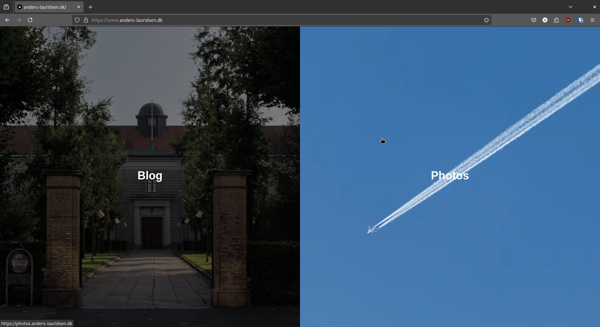

When I was a teenager, I was often in charge of using the family camera to photograph birthdays and other get-togethers. Over the years, I became more and more interested in photography, and it turned into a hobby that I love.

Last summer, I bought an expensive camera since the one I inherited from my grandfather was starting to show its age (a Canon EOS 400D DSLR). So, I upgraded to a Canon EOS RP instead.

Fast forward half a year, and I'm getting the hang of this camera. I want to showcase my photographs beyond just posting them on Instagram. I already have a domain, and Adobe Portfolio is included in my Creative Cloud subscription, so I figured I might as well use it to host my "portfolio". Now, I just need a landing page to link to both my blog and my portfolio.

---

**Table of Contents**

- [My Landing Page and Overall Setup](#my-landing-page-and-overall-setup)
  - [I Have No Idea How to Write JavaScript](#i-have-no-idea-how-to-write-javascript)
  - [My Overall Setup for My Personal Sites](#my-overall-setup-for-my-personal-sites)
- [Why I'm Not Scared That LLMs Will Take Our Jobs Anytime Soon](#why-im-not-scared-that-llms-will-take-our-jobs-anytime-soon)

---

# My Landing Page and Overall Setup



The image above is a screenshot of my landing page at the time of writing. It consists of a split view, with one image in each section, overlaid with text. When the mouse is not hovering over an image, the saturation and brightness are reduced. When hovered over, the images animate to remove these effects and zoom in slightly. The split orientation depends on the aspect ratio of the window, meaning that the page will split horizontally on phone screens. The "Blog" image links to [blog.anders-lauridsen.dk](https://blog.anders-lauridsen.dk/), while the "Photos" image links to [photos.anders-lauridsen.dk](https://photos.anders-lauridsen.dk/).

The landing page is written in JavaScript, and I should mention that I had never written any JavaScript before this. I'm still not entirely sure about some of the specifics I used for this project.

## I Have No Idea How to Write JavaScript

So why did I choose JavaScript?

Before creating the landing page, I wanted to explore my hosting options, as I didn’t want to self-host it. After some research, I decided on Vercel because of its attractive free tier for website hosting. It also happens that Vercel is the company behind Next.js, so it made sense to use their own framework for my landing page.

I set up a [GitHub repo](https://github.com/ahll19/landing-page), opened up ChatGPT, and got to work. I actually struggled quite a bit, which I’ll touch on later in this post.

## My Overall Setup for My Personal Sites

Right now, I have three websites under the domain [anders-lauridsen.dk](https://www.anders-lauridsen.dk/): my landing page, my blog, and my portfolio. My blog is still hosted on GitHub Pages, as I described in [this post](https://blog.anders-lauridsen.dk/creating-my-website). My portfolio is hosted on Adobe’s servers and created using their Adobe Portfolio tool. My landing page, as mentioned earlier, is hosted on Vercel.

Setting up HTTPS with GitHub was a bit of a hassle, as their system is very particular about DNS configurations. However, I’m happy that my entire setup is free (aside from my Adobe subscription and domain registration) and doesn’t require me to host anything myself.

# Why I'm Not Scared That LLMs Will Take Our Jobs Anytime Soon

ChatGPT did a job of creating the website as I described (notice I didn’t say *a good job*). Unfortunately, I didn't save my chat history, but suffice it to say that my first prompt got me 95% of the way there. The rest of my tokens were spent trying to get it to fix an error in its own code. Since I was using screenshots to debug, I couldn't continue the conversation after running out of free tokens—I would've had to start a new chat with another model.

Instead of opening a new ChatGPT chat, I decided to test Gemini from Google to see if it could fix ChatGPT's blunders. I spent about an hour trying, but to no avail. In the end, I resorted to the old-fashioned method: actually reading the code on my screen.

The code responsible for creating the image, text, link, and animation is within this `div` below:

```javascript
<div className="relative h-full w-full">
    <Image
    src="/IMG_0141.jpg"
    alt="Blog Image"
    fill
    priority
    sizes={isVerticalSplit ? "50vw" : "50vh"}
    className="object-cover transition-transform duration-500 filter grayscale-[30%] brightness-[50%] group-hover:grayscale-0 group-hover:brightness-100 group-hover:scale-110"
    />
    <div className="absolute inset-0 flex flex-col items-center justify-center bg-opacity-30">
    <span className="text-white text-4xl font-bold mb-2">Blog</span>
    </div>
</div>
</a>
<a
href="https://photos.anders-lauridsen.dk"
className={`relative overflow-hidden group ${
    isVerticalSplit ? "w-1/2 h-full" : "w-full h-1/2"
}`}
>
```

The problematic part of the code was in this line:

```javascript
<Image
src="/IMG_0141.jpg"
alt="Blog Image"
fill
priority
sizes={isVerticalSplit ? "50vw" : "50vh"}
className="object-cover transition-transform duration-500 filter grayscale-[30%] brightness-[50%] group-hover:grayscale-0 group-hover:brightness-100 group-hover:scale-110"
/>
```

ChatGPT had included the `bg-black` style in the className of this `<Image>` tag. I hadn’t noticed this at first (and even if I had, I wouldn’t have known it was an issue, since I’ve never done frontend development before). Gemini didn’t catch it either. After about 10 minutes of reading through the code, I finally spotted it and removed it—solving all my issues (at least with my landing page).

So why am I not scared that LLMs will take our jobs anytime soon? Because, honestly, they’re still quite dumb (sort of). Modern LLMs are amazing *tools* that allow people like me to create a landing page in an afternoon, even with no prior JavaScript experience. They can serve as a useful sounding board and work well for rubber-duck debugging. But as much as tech bros and AI influencers like to call LLMs "AI," they still lack the "intelligence" part of artificial intelligence. Predicting tokens is no substitute for critical thinking and actual experience—it's just a neat productivity booster (and does a decent job of proofreading blog posts).

Maybe I’ll be proven wrong within the next five years when AI has taken 90% of tech jobs and Teslas have actual self-driving. But I doubt it.

