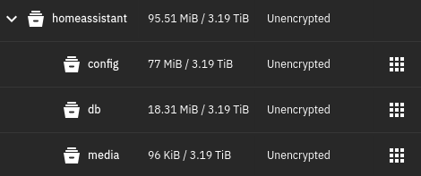
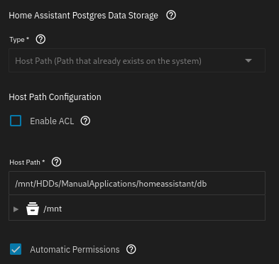
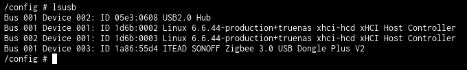

some intro

- [Why Migrate](#why-migrate)
  - [Home Assistant](#home-assistant)
    - [Installation on TrueNAS](#installation-on-truenas)
    - [Migration](#migration)
    - [Troubleshooting](#troubleshooting)
  - [Tandoor](#tandoor)
    - [Finding an alternative and easy install](#finding-an-alternative-and-easy-install)
    - [Easy migration, and PWA instaed of 3rd party app](#easy-migration-and-pwa-instaed-of-3rd-party-app)
  - [Nextcloud](#nextcloud)
  - [Setting Nextcloud up on TrueNAS](#setting-nextcloud-up-on-truenas)

# Why Migrate
I described my old server setup briefly in [this](creating-a-landing-page-and-why-llms-wont-take-our-jobs) post but here's a brief excerpt from that post:

>My dad had an old Acer Aspire XC-886 desktop lying around with a 9th-gen i3 CPU, which I ended up using for the server. I bought two 1TB SSDs and installed Ubuntu Server 22.04 on the desktop. I used [mdadm](https://linux.die.net/man/8/mdadm) to create a RAID 1 array over the two SSDs for redundancy. <br> <br> I installed [Nextcloud](https://nextcloud.com/) to back up all of the videos and photos from the hard drive. I chose Nextcloud because it did what I needed (and more), seemed easy to install, and offered Office-like capabilities I thought I might use later. Eventually, I bought a domain, got a static IP from my ISP, and made the service available to my family. <br> <br>As time went on, I wanted to run more software on the Acer server. I tried running [Pi-hole](https://pi-hole.net/) (but DNS is a pain, so I ditched that) and ended up running [Home Assistant](https://www.home-assistant.io/) instead. [This](smarthome_saga_part_1) is my latest post on that journey at the time of writing. <br> <br> So that was my setup before building the new server: an old Acer desktop running Home Assistant and Nextcloud, with ports forwarded for remote access.

## Home Assistant

My old Home Assistant setup consisted of a Docker Compose file along with a mounted volume in `/opt/homeassistant/`. a setup copied from a blog I unfortunately don't remember the name of. 

```yaml
version: '3'
services:
  homeassistant:
    container_name: homeassistant
    image: "ghcr.io/home-assistant/home-assistant:stable"
    volumes:
      - /opt/homeassistant/config:/config
      - /etc/localtime:/etc/localtime:ro
    restart: unless-stopped
    privileged: true
    network_mode: host
    ports:
      - "8123:8123"
    environment:
      - DISABLE_JEMALLOC=1
```

This install has been relatively unproblematic, and when I plugged in my Zigbee dongle it 'just worked'. I specifically used the *ZBDongle-E* model from Sonoff.

Given that this 'just works' setup was based on docker, and I wanted to move it to a docker container in TrueNAS it should be easy right? To my surprise it actually was.

### Installation on TrueNAS

I created the following datasets in TrueNAS using the App preset in the dataset creation wizard. 

In the Home Assistant configuration wizard I set all storage options to use a host path, and pointed each host path to the corresponding dataset. The only extra option which had to be set was the "Automatic Permissions" option.

Other than that, my Home Assistant instance was up and running without too much hassle.

### Migration

I created a backup on my original Home Assistant instance, downloaded it to my PC, and in the new instance I chose the "restore" option on the welcome page. It was *almost* that easy...

### Troubleshooting

My ZigBee integration simply would not work. All configuration was imported correctly, but it seemed that Home Assistant could not connect to the device.

My first troubleshooting step was to check that the container could actually see the device, which was confirmed with `lsusb`.


After digging around in the terminal for a while I went back into the Home Assistant config, and found the "device" section of the config page. It turns out that I needed to map my device to the container, in order for it to use it. This was something I had not considered since `lsusb` showed the device from a shell in the container.

## Tandoor

Old installation (docker compose). Cannot install on truenas base

### Finding an alternative and easy install

### Easy migration, and PWA instaed of 3rd party app

Maybe make a note about PWA, Apple and EU

## Nextcloud
...

I haven't migrated Nextcloud yet (continue)

## Setting Nextcloud up on TrueNAS

link to blogpost and office stuff